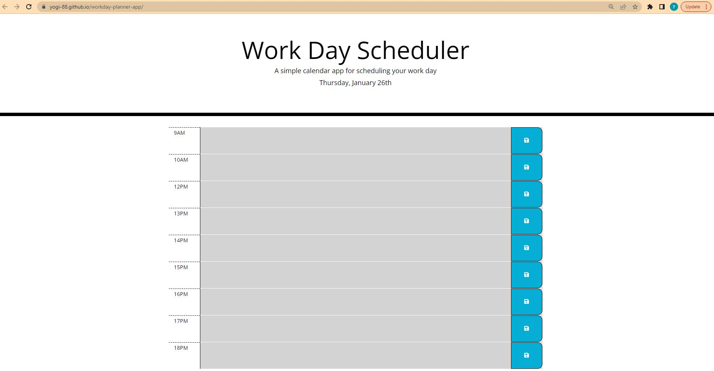

# workday-planner-app
Third-Party APIs: Work Day Scheduler

## Project Description

The purpose of this project is to allow user to save events for each hour of the day, and when user refreshed the page , user can only see events which were saved.

### User Story
```
AS AN employee with a busy schedule
I WANT to add important events to a daily planner
SO THAT I can manage my time effectively

```


### Acceptance Criteria

```
The app should:


When a user opens the planner, app displays the current day at the top of the calender 


Present timeblocks for standard business hours when the user scrolls down.


Color-code each timeblock based on past, present, and future when the timeblock is viewed.


Allow a user to enter an event when they click a timeblock


Save the event in local storage when the save button is clicked in that timeblock.


Persist events between refreshes of a page

```

### Submission
Deployed Link :
https://yogi-88.github.io/workday-planner-app/

### Technologies used

HTML, CSS, Jquery, MomentJS, Bootstarp

### Screenshots
Screenshare of Work Day Schedular App


